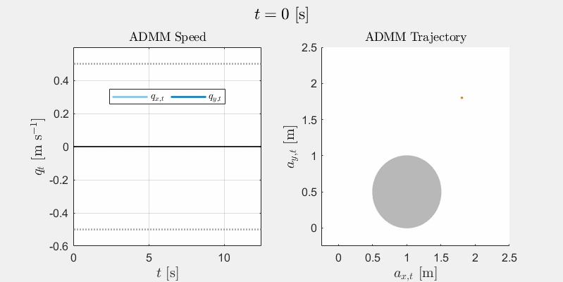

[](https://www.python.org/downloads/)

# Learning to Satisfy Constraints while Boosting the Performance with ADMM

Python implementation of ADMM for Performance Boosting
with Constraint Satisfaction as described in the article
"Learning to Satisfy Constraints while Boosting the Performance with ADMM" and [2] with Control Barrier Functions (CBFs).

## Project Setup

In order to run this project, it is recommended to use a virtual environment,
and it is required to install some dependencies. 
The setup process for both actions is automated using `setup.py`.

### Installation

Follow these steps to set up the project:

#### 1. Clone the repository
```bash
git clone https://github.com/DecodEPFL/NNs-for-OC
cd Safe_Performance_Boosting
```

#### 2. Run the setup script
Execute the following command to create a virtual environment and install dependencies:
```bash
python setup.py
```

#### 3. Activate the virtual environment
After installation, activate the environment (if working on the console):
- **On macOS/Linux:**
  ```bash
  source venv/bin/activate
  ```
- **On Windows (CMD or PowerShell):**
  ```powershell
  venv\Scripts\activate
  ```
Otherwise, activate the environment through the UI 
of your preferred development environment (PyCharm, VS Code, etc).

### Dependencies
The project requires the following dependencies, which are automatically installed from `requirements.txt`:
- `torch`
- `numpy`
- `matplotlib`
- `jax`
- `pip`
- `tqdm`
- `cvxpy`
- `clarabel`

## Benchmark case study: a point-mass robot

This pre-stabilized system with a P-controller is described by the following difference equation

```math
\begin{align}
    x_{t} \!&=\! x_{t-1}\! +\! T_s\! \!\begin{bmatrix}
        q_{t-1}\\
        \!M^{-1}(\beta_1q_{t-1}\!\!+\!\beta_2 \mathrm{tanh}(\!q_{t-1}\!)\!+\!F_{t-1}\!)\!
    \end{bmatrix}\! +w_t,\!\!\\
    F_t\!&=P(\bar{a}-a_t)+u_t,
\end{align}
```
with $x_t=[a_t^\top ~ q_t^\top]^\top$ its state composed by the Euclidian positions $a_t$ and velocities $q_t$ , respectively, $u_t$ the performance boosting input, and $w_t$ an exogenous disturbance. 

The following gif showcases the performance boosting with the safe performance boosting algorithm for velocity constraints, speeding up the convergence to $(\bar{x},\bar{u})$, and collision avoidance of an obstacle.

<p align="center">
     
</p> 

## License
This project is licensed under the terms of the `CC-BY-4.0` license.
See [LICENSE](LICENSE) for more details.


[![CC BY 4.0][cc-by-image]][cc-by] 

[cc-by]: http://creativecommons.org/licenses/by/4.0/
[cc-by-image]: https://i.creativecommons.org/l/by/4.0/88x31.png
[cc-by-shield]: https://img.shields.io/badge/License-CC%20BY%204.0-lightgrey.svg

## References
- 
[[2]](https://arxiv.org/pdf/2405.00871) Luca Furieri, Clara Galimberti, Giancarlo Ferrari Trecate.
"Learning to boost the performance of stable nonlinear closed-loop systems," 2024.

